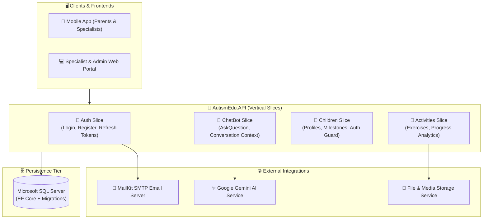

<div align="center">

# 🧩 AutismEdu.API
### AI-Powered Educational & Behavioral Platform for Children with Autism Spectrum Disorder (ASD)

[](https://dotnet.microsoft.com/)
[](https://learn.microsoft.com/en-us/dotnet/csharp/)
[](https://ai.google.dev/)
[](#-system-architecture)
[](LICENSE)
[](https://github.com/OmarAlfar0uk)

<p align="center">
  <a href="#-key-features">Key Features</a> •
  <a href="#-system-architecture">System Architecture</a> •
  <a href="#-tech-stack">Tech Stack</a> •
  <a href="#-project-structure">Project Structure</a> •
  <a href="#-getting-started">Getting Started</a> •
  <a href="#-api-reference">API Reference</a> •
  <a href="#-author">Author</a>
</p>

</div>

---

## 📌 Executive Overview

**AutismEdu.API** is an enterprise healthcare and specialized educational platform designed to empower parents, specialists, and educators supporting children on the Autism spectrum. The system bridges behavioral psychology and modern AI by offering tailored interactive learning activities, milestone tracking, and an intelligent **Google Gemini-powered ChatBot** that delivers contextual guidance and developmental assessments.

> [!NOTE]
> Engineered using **Vertical Slice Architecture** with **CQRS (Command Query Responsibility Segregation)**, **MediatR**, and **FluentValidation**, isolating feature logic to ensure maximum maintainability, scalability, and testability.

---

## ✨ Key Features

| ⚡ Feature | 💡 Description | 🛠 Engineering & Domain Detail |
|---|---|---|
| **🤖 Gemini AI Assistant** | Intelligent chatbot delivering guidance for parents and therapists | Integrated with Google Gemini API via `IGeminiService` with contextual memory |
| **🎯 Activity Engine** | Categorized developmental exercises and interactive challenges | Custom cognitive difficulty curves and real-time progress recording |
| **👶 Child Profile Tracking** | Comprehensive tracking of behavioral milestones and goals | Role-based parent/specialist authorization via `ChildAuthorizationService` |
| **🔐 Secure Authentication** | Robust RBAC for Parents, Specialists, and Administrators | ASP.NET Identity + Stateless JWT Bearer tokens + Refresh Token rotation |
| **📧 Automated Notifications** | Email verifications, password resets, and progress updates | Asynchronous email dispatch using MailKit with HTML templating |
| **🧪 Automated Unit Testing** | High-coverage authorization and domain tests | xUnit test suite with Moq for critical security and domain rules |

---

## 🏛 System Architecture

The solution implements **Vertical Slice Architecture**, organizing code by feature cohesion rather than arbitrary technical layers:



---

## ⚡ Tech Stack

| Category | Technology | Purpose |
|---|---|---|
| **Framework & Runtime** |   | Core backend runtime and modern language features |
| **AI Integration** |  | Generative behavioral guidance and diagnostic suggestions |
| **Design Pattern** |   | Feature encapsulation and command/query mediation |
| **Data & ORM** |   | Code-First migrations and relational data persistence |
| **Validation & Mapping** |  | Pipeline request validation and model safety |
| **Testing** |   | Unit testing for business logic and authorization services |

---

## 📂 Project Structure

```text
AutismEdu.API/
├── AutismEdu.API/
│   ├── Contracts/                   # Service abstractions (IGeminiService, ITokenService, etc.)
│   ├── Data/                        # EF Core ApplicationDbContext & Migrations
│   ├── Features/                    # Vertical Slices by business capability
│   │   ├── Activities/              # Activity management & tracking endpoints
│   │   ├── Auth/                    # Registration, Login, Token Refresh, Admin onboarding
│   │   ├── ChatBot/                 # Gemini AI integration handlers & DTOs
│   │   ├── ChildActivity/           # Activity completion & scoring
│   │   └── Children/                # Child profiles, assignments & guardians
│   ├── Services/                    # External service implementations (Gemini, MailKit)
│   └── Program.cs                   # Dependency injection & middleware pipeline
├── AutismEdu.API.Tests/             # Unit and integration test suite
│   ├── ChildAuthorizationServiceTests.cs
│   └── AutismEdu.API.Tests.csproj
└── AutismEdu.API.sln                # Visual Studio Solution
```

---

## 🚀 Getting Started

### Prerequisites
- [.NET 8.0 SDK](https://dotnet.microsoft.com/download/dotnet/8.0) or later
- [SQL Server](https://www.microsoft.com/en-us/sql-server/sql-server-downloads) (LocalDB, Express, or Docker container)

### Installation & Run

1. **Clone the repository:**
   ```bash
   git clone https://github.com/OmarAlfar0uk/AutismEdu.API.git
   cd AutismEdu.API
   ```

2. **Restore Dependencies & Build:**
   ```bash
   dotnet restore
   dotnet build
   ```

3. **Run the Application:**
   ```bash
   dotnet run --project AutismEdu.API
   ```
   Navigate to `http://localhost:5000/swagger` to explore the interactive OpenAPI documentation.

4. **Run the Tests:**
   ```bash
   dotnet test
   ```

---

## 📖 API Reference

| Method | Endpoint | Description | Auth Required |
|---|---|---|---|
| `POST` | `/api/Auth/Register` | Register a new parent or guardian | No |
| `POST` | `/api/Auth/Login` | Authenticate and obtain JWT + Refresh token | No |
| `POST` | `/api/Auth/RefreshToken` | Refresh an expired access token | No |
| `POST` | `/api/ChatBot/AskQuestion` | Submit a query to the Gemini AI assistant | Yes (Bearer) |
| `GET` | `/api/Children` | Retrieve all children associated with caller | Yes (Bearer) |
| `POST` | `/api/Children` | Register a new child profile | Yes (Bearer) |
| `GET` | `/api/Activities` | List curated educational activities | Yes (Bearer) |
| `POST` | `/api/ChildActivity/Submit` | Record completion and feedback for an exercise | Yes (Bearer) |

---

## 👨‍💻 Author

**Omar Alfarouk**  
*Full-Stack .NET & Software Engineer*  

- 🌐 **GitHub:** [@OmarAlfar0uk](https://github.com/OmarAlfar0uk)
- 💼 **LinkedIn:** [omar-alfarouk](https://www.linkedin.com/in/omar-alfarouk-252471251/)
- 📧 **Email:** [omaralfarouk646@gmail.com](mailto:omaralfarouk646@gmail.com)

---

<div align="center">
  <sub>Built with ❤️ by Omar Alfarouk. Licensed under the <a href="LICENSE">MIT License</a>.</sub>
</div>
