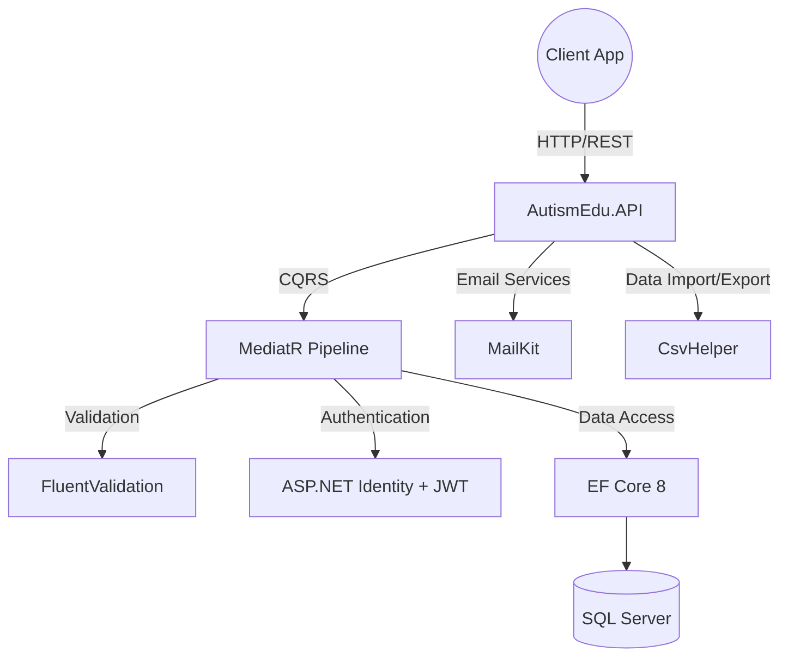

# 🧩 AutismEdu.API

[](https://dotnet.microsoft.com/)
[](https://docs.microsoft.com/en-us/dotnet/csharp/)
[](https://docs.microsoft.com/en-us/ef/core/)
[](https://www.microsoft.com/en-us/sql-server)
[](https://opensource.org/licenses/MIT)

**AutismEdu.API** is an educational backend service designed for children with autism. It provides robust endpoints to manage and track children's progress, interactive lessons, communication cards, Text-to-Speech (TTS) content, specialized activities, and detailed performance records, providing an adaptive learning environment tailored to their needs.

## 🏗️ Architecture & Flow



## ✨ Features

| Feature | Description |
|---------|-------------|
| **Authentication & Authorization** | Secure JWT-based authentication, user registration, login, and profile updates. |
| **Child Management** | Create and manage profiles for children, linking them to specific parents/patients. |
| **Interactive Lessons** | Structure and deliver educational content with child-specific lesson levels. |
| **Communication Cards** | Manage visual communication tools (cards) to assist in expression and learning. |
| **Text-to-Speech (TTS)** | Endpoints handling TTS content to aid auditory learning. |
| **Activity Tracking** | Record and monitor specific activities assigned to children. |
| **Performance Records** | Detailed tracking of a child's performance and progress over time. |
| **Guidelines & Reports** | Access established guidelines and generate comprehensive progress reports. |
| **ChatBot Integration** | Log and manage interactions with integrated educational chatbots. |

## 🛠️ Tech Stack

| Category | Technology |
|----------|------------|
| **Framework** | .NET 8.0, ASP.NET Core Web API |
| **Language** | C# 12 |
| **Architecture** | Monolithic API, CQRS Pattern |
| **Data Access** | Entity Framework Core 8, SQL Server |
| **Identity & Security**| ASP.NET Core Identity, JWT Bearer Authentication |
| **Libraries** | MediatR 10, FluentValidation 12, MailKit, CsvHelper |
| **Testing** | xUnit (AutismEdu.API.Tests) |

## 📂 Project Structure

```text
AutismEdu.API/
├── AutismEdu.API/           # Main API Application
│   ├── Controllers/         # RESTful API Endpoints
│   ├── Models/              # Domain Entities (ApplicationUser, ChildProfile, etc.)
│   ├── Features/            # CQRS Handlers (Activities, Auth, Children, etc.)
│   ├── Program.cs           # Application entry point
│   └── ...
└── AutismEdu.API.Tests/     # xUnit Test Project
```

## 🚀 Getting Started

To get the project up and running locally, execute the following commands:

```bash
git clone https://github.com/OmarAlfar0uk/AutismEdu.API.git
cd AutismEdu.API
dotnet restore
dotnet run --project AutismEdu.API
```

---
**Author**  
GitHub: [OmarAlfar0uk](https://github.com/OmarAlfar0uk) | LinkedIn: [omar-alfarouk-252471251](https://www.linkedin.com/in/omar-alfarouk-252471251/) | Email: [omaralfarouk646@gmail.com](mailto:omaralfarouk646@gmail.com)
